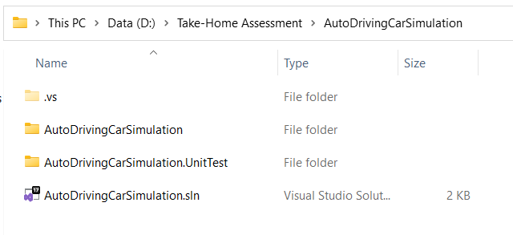
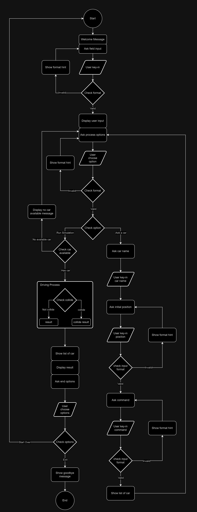

# Auto Driving Car Simulation
## Content
  - [Design Principle](#design-principle-≡)    
  - [Environment and Platform](#environment-and-platform-≡)
  - [Build and Run Program](#build-and-run-program-≡)
  - [Test Scenarios](#test-scenarios-≡)
  - [Edges case assumption](#collision-scenario-after-car-a-stopped-▲)
  - [Unit Test Coverage](#unit-test-coverage-≡)
  - [Flow Diagram](#flow-diagram-≡)

## Design principle [≡](#content)
- Single responsibility principle(SRP) and Open Closed Principle
  -
  As per requirement, system need to ask few input. For example,
    - Asking process options (Add a car or Run simulation)
    - Asking exit options (Start over or Exit)

  So, `AskExitOptionService` and `AskProcessOptionService` classes are created for each above scenarios and each `Ask()` method within class is asking only their respective question. It is follow `"SRP"`.

  Since `Ask()` method is open to extend for each `AskExitOptionService` and `AskProcessOptionService` class. It is follow `"Open Closed Principle"` as well.
  
   

  

- Liskov Substitution Principle and Interface Segregation Principle(ISP)
  -
  `CarService` and `AskPositionService` class require to ask user input and processing input. Each class has same functionality to ask user input but process will be different. So, both classes inherit to `ServiceBase` class (which can be interface) to achive prompt service, but `CarService` implement to `ICarService` interface and `AskPositionService` implement to `IAskPositionService` to do their process.

  

  

- Dependency Inversion Principle
  -
  As per following code inside client class `Process`, it is breaking `DIP` principle. If want to change display format of showing list of car or showing with other language, require to break existing format. To follow `DIP` principle, it should create separate class `ShowListCarService` and implement to base `IPromptService`, then put whatever format inside `ShowListCarService` class. If want to change another display format, just create separate `ShowListCarService_AnotherFormat` class and inject in client class `Process`. 

  

## Environment and Platform [≡](#content)
- Window x64
- .Net Core 6

## Build and Run Program [≡](#content)
  - CLI
    -
    To build project from the CLI, run the following command from the root folder:

    ```
    dotnet build AutoDrivingCarSimulation --configuration Release
    ```
    

    To start program from the CLI, run the following command from the root folder:
    ```
    AutoDrivingCarSimulation\AutoDrivingCarSimulation\bin\Release\net6.0\AutoDrivingCarSimulation.exe
    ```
    Program will start and asking to input field width and height.

    

- Visual Studio
  -
  To start, open the `AutoDrivingCarSimulation.sln` solution file in Visual Studio. Make sure `AutoDrivingCarSimulation` set as the default startup project. Now you can build and run the application by pressing `Ctrl+F5`.

  

  

  Program will start and asking to input field width and height.

    


## Test Scenarios [≡](#content)
All scenarios are base on width:10 x heigh:10 field.
- [No Collision Scenario (Single Car)](#no-collision-scenario-single-car-▲)
- [No Collision Scenario (Multiple Car)](#no-collision-scenario-multiple-car-▲)
- [Beyond Field Scenario](#beyond-field-scenario-▲)
- [Collision Scenario](#collision-scenario-▲)
- [Collision Scenario (After car `A` stopped)](#collision-scenario-after-car-a-stopped-▲)

- ### No Collision Scenario (Single Car) [▲](#test-scenarios-≡)
  Car `A`, initial position x:1, y:2 and face to North. Driving command is "FFRFFFFRRL"

  

  `Output :`

  


- ### No Collision Scenario (Multiple Car) [▲](#test-scenarios-≡)
  Car `A`, initial position x:1, y:2 and face to North. Driving command is "FFRFFFFRRL"

  Car `B`, initial position x:4, y:0 and face to North. Driving command is "FRFLFRFF"

  
  

- ### Beyond Field Scenario [▲](#test-scenarios-≡)
  Car `A`, initial position x:1, y:2 and face to North. Driving command is "FFFFFFFFFF"

  
  

- ### Collision Scenario [▲](#test-scenarios-≡)
  Car `A`, initial position x:1, y:2 and face to North. Driving command is "FFRFFFFRRL"

  Car `B`, initial position x:7, y:8 and face to West. Driving command is "FFLFFFFFFF"

  
  

- ### Collision Scenario (After car `A` stopped) [▲](#test-scenarios-≡)
  Car `A`, initial position x:1, y:2 and face to North. Driving command is "FFRFF"

  Car `B`, initial position x:7, y:8 and face to West. Driving command is "FFLFFFFFFFRFFRFFFFF"

  
  

## Unit Test Coverage [≡](#content)


## Flow Diagram [≡](#content)

